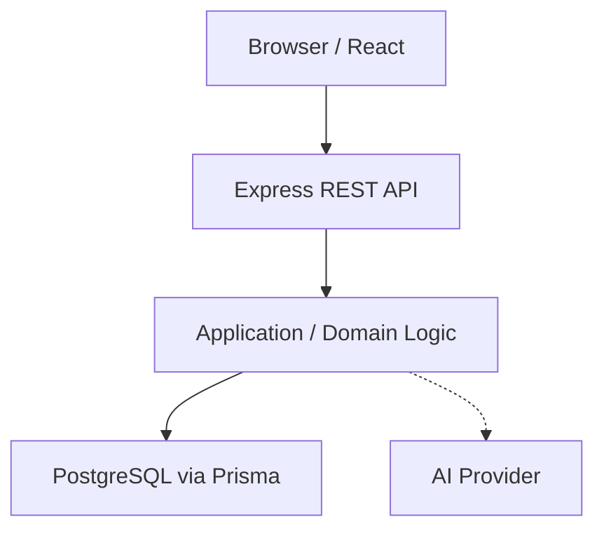

# Architecture Overview

## High Level

WASL uses a simple modular monolith architecture for the MVP phase.

## Frontend (apps/web)
- **Framework**: React + Vite + TypeScript
- **Styling**: Tailwind CSS
- **Routing**: React Router
- **Data Fetching**: TanStack Query (to be implemented)
- **Forms**: React Hook Form + Zod

## Backend (apps/api)
- **Framework**: Node.js + Express + TypeScript
- **Database**: PostgreSQL
- **ORM**: Prisma
- **Validation**: Zod
- **Architecture**: Modular Monolith

## Contracts (packages/contracts)
Contains shared Zod schemas and TypeScript types. This ensures the frontend and backend share the same source of truth for API boundaries, reducing duplication and drift.
